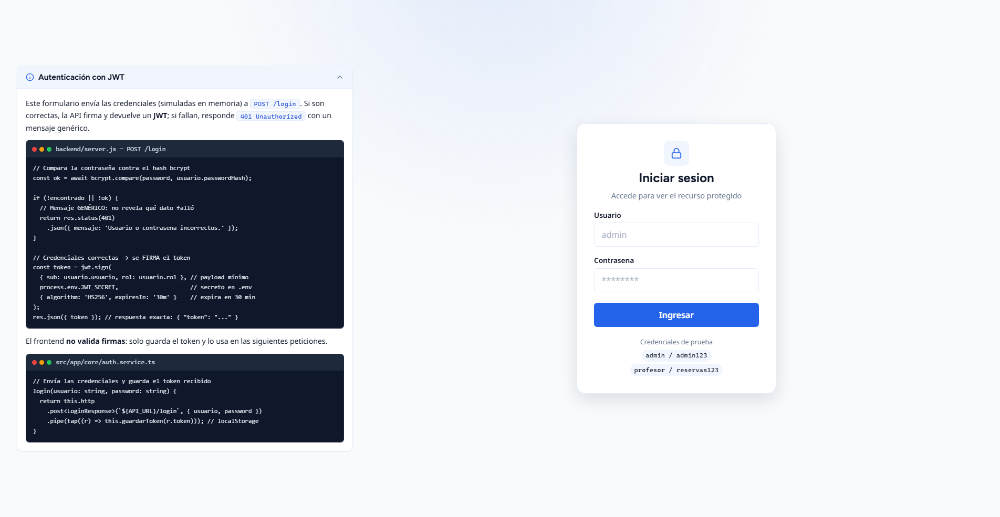
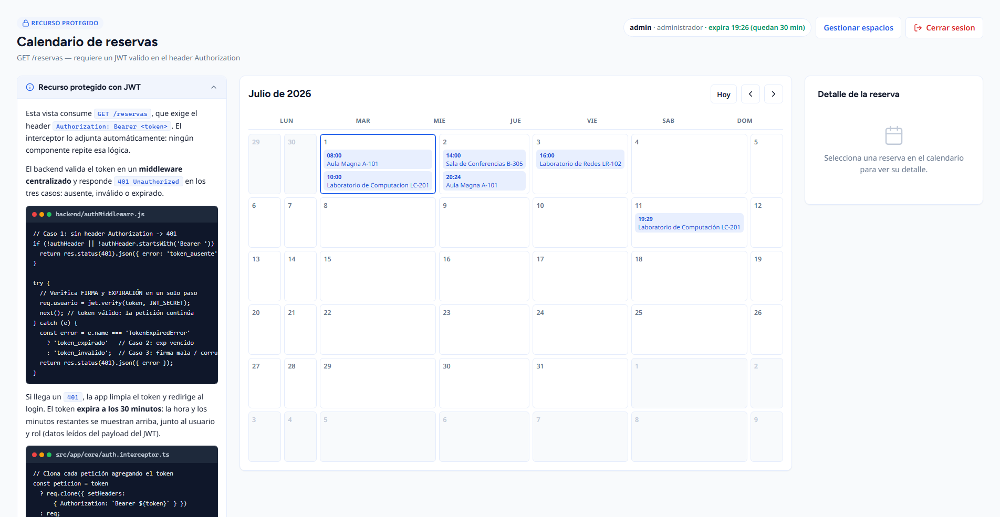
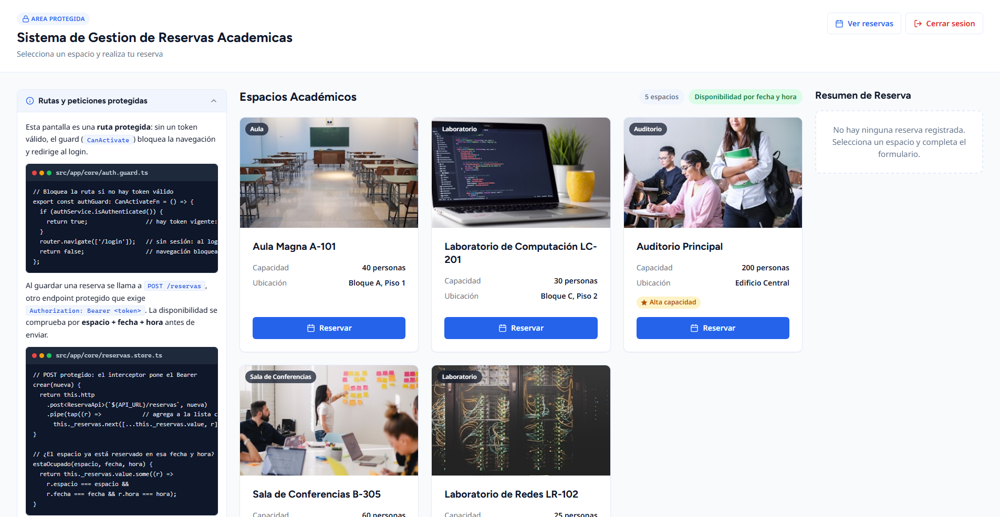
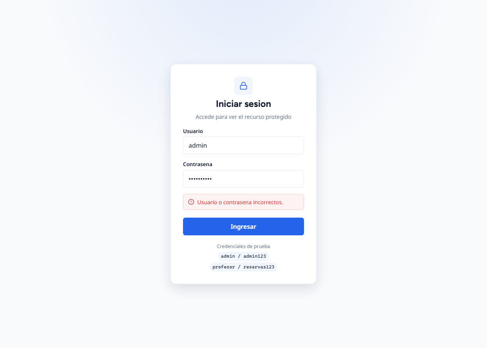
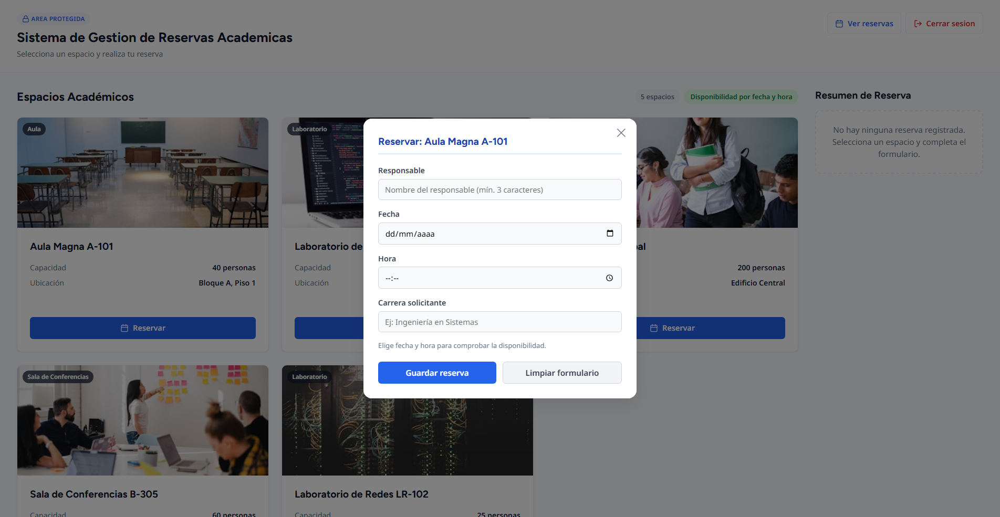

# Mejoras de Frontend (UI/UX) — Gestión de Reservas con JWT

Documento de apoyo para el informe. Resume **qué se mejoró**, **por qué** y **qué fragmento
de código** lo implementa. Las mejoras se hicieron aplicando la metodología de dos *skills* de
diseño instaladas en el proyecto (`impeccable` y `ui-ux-pro-max`): sistema de tokens, estados de
interacción completos, accesibilidad y un estilo Minimalista/Swiss con paleta y tipografía
recomendadas.

## Cuadro general

| # | Qué hicimos | Por qué | Archivo(s) | Fragmento clave |
|---|-------------|---------|------------|-----------------|
| 1 | **Sistema de diseño con tokens** (paleta, tipografías Figtree+Noto Sans, espaciado, radios, sombras, transiciones) | Eliminar colores "sueltos" (drift) y dar consistencia a todas las pantallas | [`src/styles.css`](../src/styles.css) | bloque `:root { --color-primary … }` |
| 2 | **Login rediseñado** con estados hover/focus/loading/disabled/error, icono SVG y objetivo táctil 44px | Es la entrada al flujo de autenticación; debe ser claro y accesible | [`login.component.html`](../src/app/features/login/login.component.html), [`login.component.css`](../src/app/features/login/login.component.css) | `.login-btn`, `.spinner`, `.login-error` |
| 3 | **Decodificación del token** (`getPayload()`) y **tarjeta de sesión** que muestra `sub`, `rol`, `exp` | Demostrar que el payload es Base64 legible (apoya el análisis del token) | [`auth.service.ts`](../src/app/core/auth.service.ts), [`reservas.component.html`](../src/app/features/reservas/reservas.component.html) | método `getPayload()` y `.sesion-card` |
| 4 | **Vista de Reservas** con skeleton de carga, estado vacío, estado de error y tabla pulida | Cubrir todos los estados (no solo el "happy path") del recurso protegido | [`reservas.component.*`](../src/app/features/reservas/) | `.skeleton-tabla`, `.estado-vacio`, `.estado-error` |
| 5 | **Consistencia en Espacios** (colores a tokens, iconos SVG en botones de cabecera) | Que la pantalla existente combine con login y reservas | [`espacios-page.component.*`](../src/app/features/espacios/) | `.btn-header` + SVG |
| 6 | **Botones unificados** (tarjeta de espacio y formulario) a la paleta de tokens | Mismo lenguaje visual en toda la app | [`espacio-card.component.css`](../src/app/components/espacio-card/espacio-card.component.css), [`reserva-form.component.css`](../src/app/components/reserva-form/reserva-form.component.css) | `.btn-seleccionar`, `.btn-guardar` |
| 7 | **Animación de entrada** suave (respeta `prefers-reduced-motion`) | Percepción de calidad sin marear al usuario | [`src/styles.css`](../src/styles.css) | `@keyframes aparecer` + `.animar-entrada` |

## Relación con las funcionalidades JWT de la tarea

| Funcionalidad de la tarea | Dónde se evidencia en el frontend | Fragmento |
|---------------------------|-----------------------------------|-----------|
| **1. Endpoint de autenticación (`POST /login`)** | Formulario de login que envía credenciales | `AuthService.login()` en [`auth.service.ts`](../src/app/core/auth.service.ts) |
| **2. Generación del JWT** | Token recibido, guardado y **mostrado decodificado** | `getPayload()` + `.sesion-card` |
| **3. Endpoint protegido (`GET /reservas`)** | Vista que consume el recurso con `Bearer` automático | interceptor [`auth.interceptor.ts`](../src/app/core/auth.interceptor.ts) |
| **4. Validación del token (401)** | Error genérico en login y redirección al recibir 401 | manejo de error en login + `catchError` del interceptor |
| **5. Pruebas (Postman)** | Colección con las 4 requests | [`postman/JWT-Reservas.postman_collection.json`](../postman/JWT-Reservas.postman_collection.json) |

## Fragmentos destacados

### Tokens de diseño (`src/styles.css`)
```css
:root {
  --color-primary: #2563eb;
  --color-accent: #059669;
  --color-bg: #f8fafc;
  --color-fg: #0f172a;
  --color-danger: #dc2626;
  /* …espaciado, radios, sombras, transiciones… */
}
```

### Decodificación del payload (`auth.service.ts`)
```ts
// Demuestra que el payload del JWT es Base64 legible (no lleva datos sensibles)
getPayload(): { sub?: string; rol?: string; exp?: number } | null {
  const token = this.getToken();
  if (!token) { return null; }
  try {
    const payloadBase64 = token.split('.')[1];
    return JSON.parse(atob(payloadBase64));
  } catch { return null; }
}
```

### Tarjeta de sesión (`reservas.component.html`)
```html
<div class="sesion-card" *ngIf="sesion">
  <div class="sesion-item"><span class="sesion-label">Usuario (sub)</span>
    <span class="sesion-valor">{{ sesion.sub }}</span></div>
  <div class="sesion-item"><span class="sesion-label">Rol</span>
    <span class="sesion-valor">{{ sesion.rol }}</span></div>
  <div class="sesion-item"><span class="sesion-label">Token expira</span>
    <span class="sesion-valor">{{ (sesion.exp || 0) * 1000 | date:'short' }}</span></div>
</div>
```

## Capturas (carpeta `docs/capturas/`)

| Archivo | Estado | Evidencia para |
|---------|--------|----------------|
| `01-login.png` | Pantalla de login | Funcionalidad 1 (entrada al flujo) |
| `02-reservas.png` | Recurso protegido + tarjeta de sesión (payload decodificado) | Funcionalidades 2 y 3 |
| `03-espacios.png` | Pantalla de gestión (protegida), rediseñada al estilo claro | Vista existente integrada al login |
| `04-login-error-401.png` | Error genérico por credenciales inválidas | Funcionalidad 4 (manejo de 401) |
| `05-espacios-modal.png` | Modal de reserva sobre la pantalla de espacios | Flujo de creación de reserva |
| `06-presentacion.png` | Vista de presentación (`/presentacion`): lista de sitios + panel con explicación y código | Presentar lo realizado |
| `07-reservas-calendario.png` | Reservas como **calendario** + panel de **detalle** de la reserva seleccionada | Funcionalidad 3 + alta de reservas |
| `08-form-libre.png` | Formulario indicando que el espacio está **libre** en esa fecha/hora | Disponibilidad por franja |
| `09-form-ocupado.png` | Formulario indicando **ocupado** (botón Guardar deshabilitado) | Disponibilidad por franja |
| `10-integrantes.png` | Presentación → **Integrantes y responsabilidades** (qué hizo cada uno y en qué sitio) | Distribución del trabajo |
| `11-postman.png` | Presentación → **Pruebas con Postman** (4 requests con método, URL, estado esperado y test) | Funcionalidad 5 |
| `12-presentacion-en-vivo.png` | Presentación **unificada**: pasos + explicación/código + **app real embebida** (en vivo) | Exponer mostrando la app en vivo |
| `13-demo-guiada.png` | **Demo guiada** en marcha (Paso 5/8) avanzando sola por la app en vivo | Recorrido automático para exponer |

## Pantalla /pruebas: las 4 requests de Postman ejecutadas en vivo

Nueva ruta pública **`/pruebas`** ([`features/pruebas/`](../src/app/features/pruebas/)) que cubre la
**Funcionalidad 5** de forma demostrable: ejecuta contra el backend real las mismas 4 requests de la
colección `postman/JWT-Reservas.postman_collection.json` y muestra por cada una el header enviado,
el status HTTP, el cuerpo de la respuesta y el veredicto **PASS/FAIL** (comparado con el status
esperado, igual que `pm.test`). Botón "Ejecutar todas" (equivalente a *Run collection*) con resumen
"4 / 4 pruebas OK". Usa `fetch` nativo (no HttpClient) a propósito, para esquivar el interceptor y
poder mostrar los 401 crudos sin que la app cierre la sesión. Captura: `04-pruebas-en-vivo.png`.
Accesos: enlace en el login y botón "Pruebas de API" en reservas y espacios.

## Cambio final 2: paneles explicativos laterales con código (heurísticas de Nielsen)

Los paneles ahora van **al lado izquierdo** de cada pantalla, a lo ancho, sin el título
"lo que pide la tarea", y con **fragmentos de código reales comentados**:

| Pantalla | Panel izquierdo | Fragmentos |
|----------|-----------------|------------|
| Login | "Autenticación con JWT" — POST /login, 401 genérico, token 30 min | `server.js` (bcrypt + jwt.sign) y `auth.service.ts` (login) |
| Reservas | "Recurso protegido con JWT" — Bearer, 3 casos 401, expiración visible | `authMiddleware.js` y `auth.interceptor.ts` |
| Espacios | "Rutas y peticiones protegidas" — guard + POST protegido + disponibilidad | `auth.guard.ts` y `reservas.store.ts` |

Componentes: [`panel-explicacion/`](../src/app/components/panel-explicacion/) (panel colapsable,
sticky) y [`code-card/`](../src/app/components/code-card/) (tarjeta de código estilo editor).

**Heurísticas de Nielsen aplicadas:** #1 visibilidad del estado (expiración del token, estados de
carga), #4 consistencia (mismo patrón de panel en las 3 pantallas), #6 reconocimiento antes que
recuerdo (la explicación está en contexto, junto a la pantalla que describe), #8 diseño minimalista
(panel colapsable; en pantallas pequeñas la acción principal va primero), #10 ayuda y documentación
(ayuda contextual permanente).

## (Historial) Cambio final: solo la app, con explicaciones integradas

> **Nota:** la vista `/presentacion` y la demo guiada fueron **eliminadas** a pedido del grupo.
> En su lugar, la propia app explica lo que pide la tarea en cada pantalla:

| Pantalla | Panel "Lo que pide la tarea" | Extra |
|----------|------------------------------|-------|
| Login | Funcionalidades 1 y 2: `POST /login`, credenciales simuladas, `{ token }`, 401 genérico | — |
| Reservas | Funcionalidades 3 y 4: `GET /reservas` con Bearer, los tres casos de 401 | Chip de sesión muestra **cuándo expira el token** y los **minutos restantes** (se refresca cada 30 s) |
| Espacios | Ruta protegida por guard + `POST /reservas` protegido | — |

Implementado con un componente reutilizable y colapsable:
[`components/info-tarea/`](../src/app/components/info-tarea/) (proyección de contenido con `ng-content`).
El contador de expiración vive en [`reservas.component.ts`](../src/app/features/reservas/reservas.component.ts)
(`actualizarExpiracion()` sobre el claim `exp` del payload).

## (Historial) Demo guiada e integrantes

- **Demo guiada:** botón "▶ Demo guiada" en la barra superior. Recorre automáticamente una
  secuencia de pasos (~7s c/u), mostrando explicación + código y conduciendo la app embebida a la
  pantalla de cada paso. Inicia sesión sola para que las pantallas protegidas se vean en vivo.
  Indicador "Paso X / N" y botón "■ Detener demo". Un clic manual en la barra lateral la detiene.
  Implementado en [`presentacion.component.ts`](../src/app/features/presentacion/presentacion.component.ts) (`toggleDemo`, `iniciarDemo`, `aplicarPasoDemo`).
- **Integrantes (4):** Millie Alvarez (investigación REST + JWT), Odalis Jacome (login + token),
  Barbara Rodas (protección de endpoints), Romario Alban (Postman, documentación e informe). Las
  dos tareas de investigación se agruparon en un integrante (5 responsabilidades → 4 personas).

## Presentación en vivo (app + presentación = una sola)

La vista `/presentacion` integra la **aplicación real en un iframe** (mismo origen) junto al guion:

| Parte | Qué hace | Detalle |
|-------|----------|---------|
| Columna 1 — Pasos | Lista de sitios agrupados (Equipo, Backend, Frontend, Diseño) | al seleccionar uno con pantalla, la app embebida navega a esa ruta |
| Columna 2 — Explicación | Descripción + fragmento de código / integrantes / Postman | igual que antes |
| Columna 3 — App en vivo | La app corriendo en un `<iframe>` con barra tipo navegador y pestañas Login / Reservas / Espacios | totalmente interactiva: se puede iniciar sesión, crear reservas, etc. |

Implementado en [`presentacion.component.ts`](../src/app/features/presentacion/presentacion.component.ts) con `DomSanitizer` para el `src` del iframe y un método `cargarRuta()`. Cada sección visual (`login-ui`, `reservas-ui`, `espacios-ui`) define una `ruta` que conduce la app embebida.

## Presentación: equipo y evidencias

La vista `/presentacion` se complementó con un grupo **"Equipo y evidencias"**:

| Apartado | Qué muestra | Archivo |
|----------|-------------|---------|
| **Integrantes y responsabilidades** | Tarjeta por estudiante con su responsabilidad, el **sitio del proyecto** donde se refleja y los archivos concretos | [`presentacion.component.ts`](../src/app/features/presentacion/presentacion.component.ts) |
| **Pruebas con Postman** | Las 4 requests (método, URL `{{baseUrl}}`, estado esperado y fragmento del test script) | espejo de [`postman/JWT-Reservas.postman_collection.json`](../postman/JWT-Reservas.postman_collection.json) |

## Nueva lógica de disponibilidad (por fecha + hora)

Antes un espacio quedaba "No disponible" para siempre tras una reserva. Ahora **todos los espacios
son reservables** y la disponibilidad se calcula por **franja (espacio + fecha + hora)**.

| Qué | Cómo | Archivo |
|-----|------|---------|
| Comprobar si una franja está ocupada | `estaOcupado(espacio, fecha, hora)` sobre la lista de reservas | [`reservas.store.ts`](../src/app/core/reservas.store.ts) |
| El formulario avisa si se puede o no | `get disponibilidad()` → `libre` / `ocupado` / `incompleto`; banner verde/rojo y botón deshabilitado si ocupado | [`reserva-form.component.*`](../src/app/components/reserva-form/) |
| Espacios siempre reservables | Se quitó el bloqueo por `disponible`; botón "Reservar" siempre activo | [`espacio-card.component.*`](../src/app/components/espacio-card/) |
| Rediseño de tarjetas | Badge de tipo sobre la imagen, datos en filas etiqueta/valor, fallback si la imagen no carga, imagen del auditorio corregida | [`espacio-card.component.*`](../src/app/components/espacio-card/) |

## Reservas como calendario + alta de reservas

| Qué | Cómo | Archivo |
|-----|------|---------|
| Nuevo endpoint protegido para crear reservas | **`POST /reservas`** (con authMiddleware): valida, asigna id y la agrega | [`backend/server.js`](../backend/server.js) |
| Lista compartida que se actualiza al crear | **`ReservasStore`** (BehaviorSubject): `cargar()` (GET) y `crear()` (POST + push) | [`reservas.store.ts`](../src/app/core/reservas.store.ts) |
| El formulario de espacios crea la reserva | Al guardar llama `store.crear(...)`; aparece en el calendario | [`reserva-form.component.ts`](../src/app/components/reserva-form/reserva-form.component.ts) |
| Vista de reservas como **calendario mensual** | Cuadrícula 6×7, navegación de mes, chips por día | [`reservas.component.ts`](../src/app/features/reservas/reservas.component.ts) |
| **Detalle** de la reserva seleccionada al lado | Panel lateral que muestra los datos al hacer clic en una reserva | [`reservas.component.html`](../src/app/features/reservas/reservas.component.html) |







## Pasada de diseño sobre la sección Espacios

Aplicando la crítica de `impeccable` (consistencia/IA, tokens, estados, accesibilidad):

| Hallazgo | Acción | Archivo |
|----------|--------|---------|
| Las dos pantallas protegidas no parecían el mismo producto (espacios tenía cabecera con degradado oscuro) | Cabecera **clara estilo Swiss** con badge "Área protegida", igual que reservas | [`espacios-page.component.*`](../src/app/features/espacios/) |
| Botones duplicados entre componentes | **Sistema de botones global** (`.btn`, `.btn-secundario`, `.btn-logout`) en `styles.css`, reutilizado | [`styles.css`](../src/styles.css) |
| Colores hardcodeados en lista, tarjeta y resumen | Migrados a **tokens** (`--color-*`, radios, sombras) | `lista-espacios`, `espacio-card`, `resumen-reserva` |
| `★` (unicode) como icono de alta capacidad | Reemplazado por **badge con SVG** | [`espacio-card.component.html`](../src/app/components/espacio-card/espacio-card.component.html) |
| Contador plano "Espacios disponibles" | **Chips de estadística** (total / disponibles) | [`lista-espacios.component.*`](../src/app/components/lista-espacios/) |
